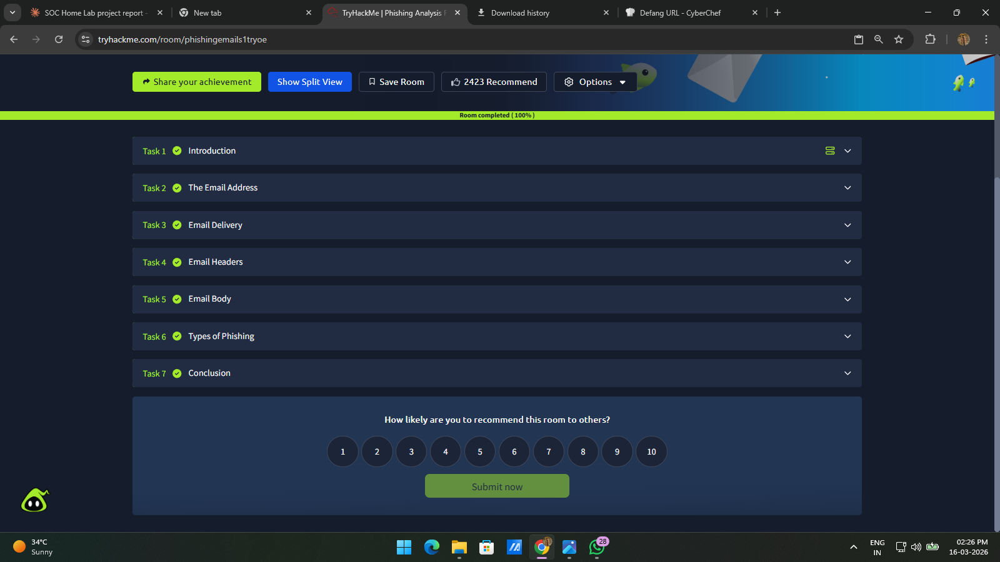
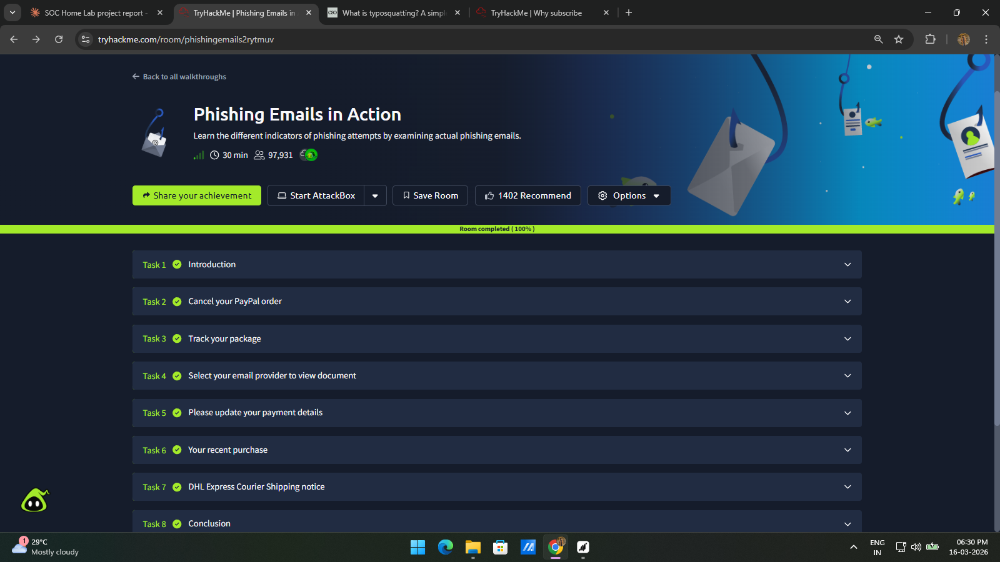
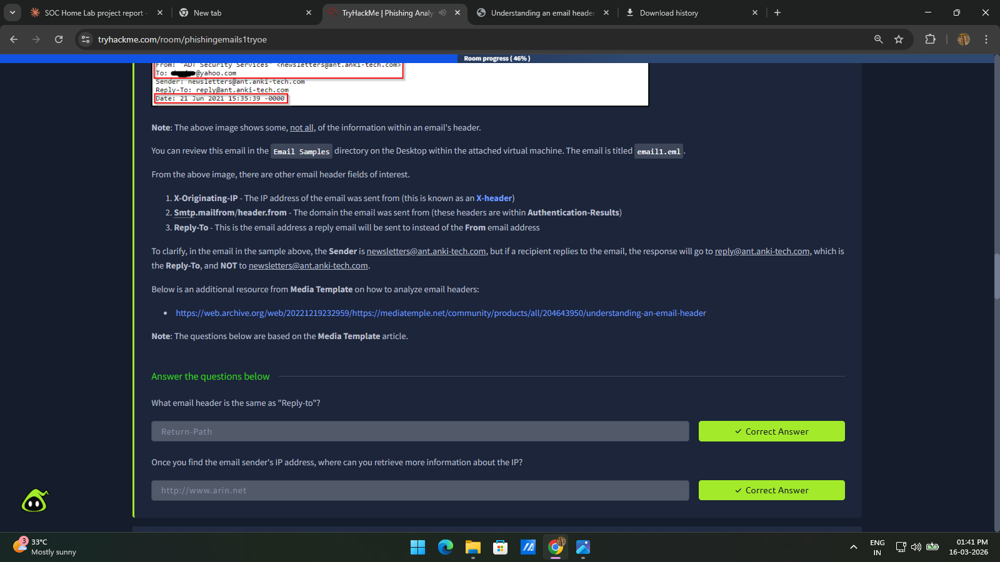
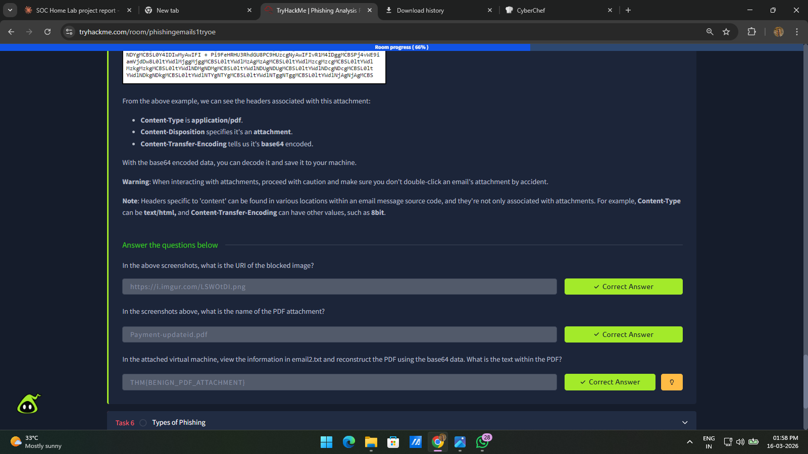
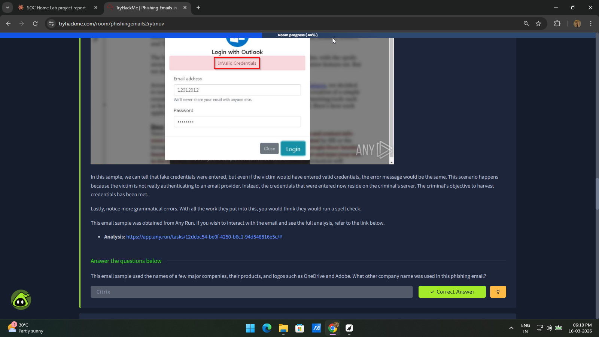

# Phishing Email Analysis
## Identifying Malicious Emails & Indicators of Compromise

---

## Project Overview

Phishing is one of the most common attack vectors SOC analysts encounter daily. 
This project demonstrates the complete phishing email investigation workflow — 
from analyzing email headers and identifying spoofed senders, to detecting 
malicious URLs, investigating fake login pages, and mapping findings to the 
MITRE ATT&CK framework.

Two TryHackMe rooms were completed using real phishing email samples.

---

## TryHackMe Rooms Completed

| Room | Description | Status |
|------|-------------|--------|
| Phishing Emails 1 | Email headers, delivery protocols, phishing indicators | ✅ 100% |
| Phishing Emails in Action | Real phishing sample investigation | ✅ 100% |

---

## Screenshots

### Room 1 – Phishing Emails 1 Completed

*Phishing Emails 1 completed with 100% — covered email structure, headers, delivery protocols and key phishing indicators.*

---

### Room 2 – Phishing Emails in Action Completed

*Phishing Emails in Action completed with 100% — analyzed real phishing samples including credential harvesting pages and malicious attachments.*

---

### Email Header Analysis

*Email header investigation revealed spoofed sender — display name showed ADI Security Services but actual sender was newsletters@ant.anki-tech.com with a different Reply-To address, a clear phishing indicator.*

---

### Email Body & Attachment Analysis

*Email body analysis uncovered a malicious PDF attachment named Payment-updateid.pdf containing base64 encoded content — a common technique used to hide malicious payloads.*

---

### Fake Login Page – Credential Harvesting

*A fake Microsoft Outlook login page was identified — it displayed Invalid Credentials regardless of input, confirming that entered credentials were being sent directly to the attacker's server.*

---

## Key Findings

| # | Finding | Indicator | MITRE ATT&CK |
|---|---------|-----------|--------------|
| 1 | Email Spoofing | Sender and Reply-To mismatch | T1566.001 |
| 2 | Malicious URL | hxxp[://]devret[.]xyz | T1566.002 |
| 3 | Brand Impersonation | Home Depot, Microsoft, Adobe | T1566 |
| 4 | Credential Harvesting | Fake Outlook login page | T1056.003 |
| 5 | Tracking Pixel | Tracking.png embedded in email | T1598 |
| 6 | Malicious Attachment | Payment-updateid.pdf | T1566.001 |

---

## Tools Used

| Tool | Purpose |
|------|---------|
| TryHackMe | Lab environment with real phishing samples |
| Mozilla Thunderbird | Analyzing .eml email files |
| CyberChef | URL defanging and base64 decoding |
| MITRE ATT&CK | Threat intelligence framework mapping |

---

## Author

**Muhammed Anshad**
Certified SOC Analyst (CSA) – EC-Council
[LinkedIn](https://www.linkedin.com/in/muhemmed-a501a0)
[GitHub](https://github.com/anshadshanu)
